# Send e-mails using Microsoft Graph

## 1. Prerequisites

**Microsoft Azure**

To create an application registration that can be used to send e-mails via Microsoft Graph, you will need an active Microsoft Azure account including a Microsoft Entra ID (former Azure Active Directory). You can sign up for a free Microsoft Azure account here [https://azure.microsoft.com/en-in/free/](https://azure.microsoft.com/en-in/free/).

> **Hint** - For testing purposes, you can go with a free Azure account and you don't need a paid Azure subscription.

## 4. Create an Application Registration

You can use a standard Microsoft Entra ID (former Azure Active Directory) **Application Registration** to send e-mails using the Microsoft Graph API. An application registration allows you to retrieve access tokens from Microsoft Entra ID (former Azure Active Directory) for a certain scope (e.g., Microsoft Graph usage). The authorized scopes/permissions can be defined for each Application Registration. The process to create such an Application Registration is very simple.

4.1. Go to the [Azure Portal](https://portal.azure.com/#home) and access your Microsoft Entra ID (former Azure Active Directory) instance.

[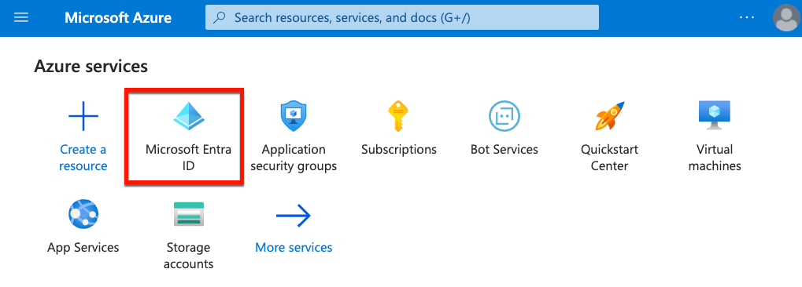](./images/Azure_AppReg01.png?raw=true)

4.2. Switch to **App registrations** and click on **New registration**.

[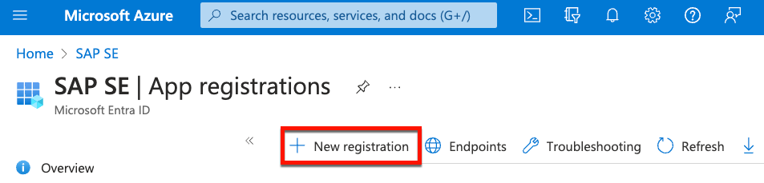](./images/Azure_AppReg02.png?raw=true)

4.3. Define a name of your choice, select the **Any Entra ID Tenant + Personal Microsoft Accounts** mode and click on **Register**.

[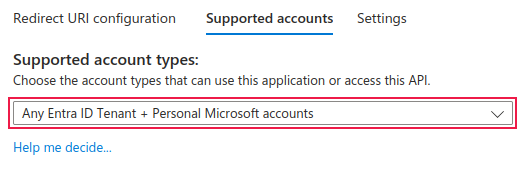](./images/Azure_AppReg03.png?raw=true)

4.4. Your Application Registration is created and you are redirected to the Overview page.

> **Hint** - Note the **Application (client) ID** and the **Directory (tenant) ID**. You will need these values for authentication in your sample application.

[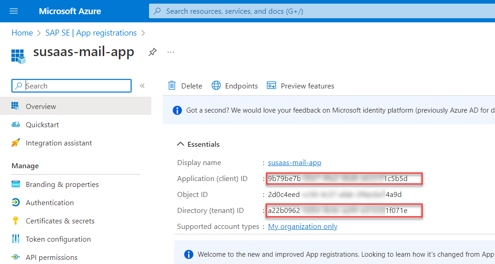](./images/Azure_AppReg04.png?raw=true)

4.5. Switch to **API permissions** and click on **Add a permission**.

[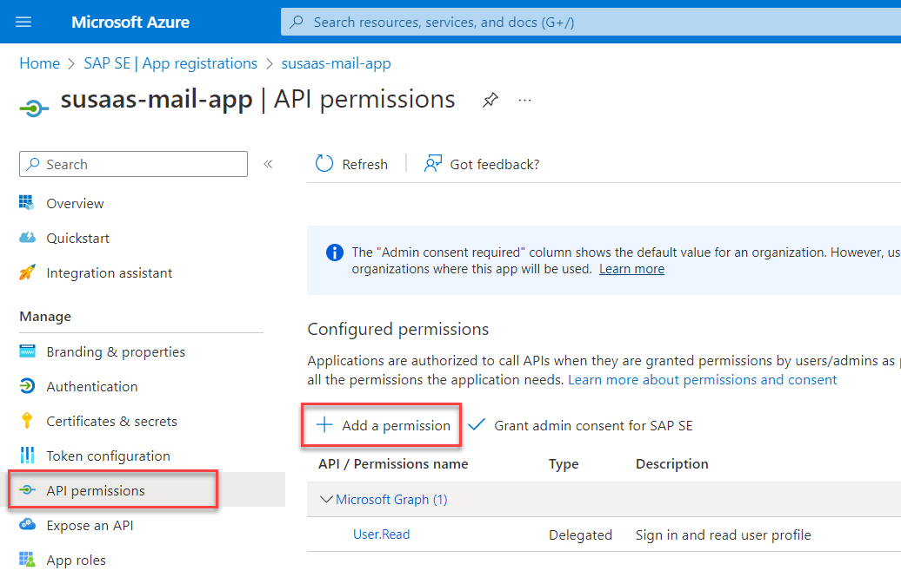](./images/Azure_AppReg05.png?raw=true)

4.6. Select **Microsoft Graph** from the available APIs, click on **Delegated permissions** and search for the **Mail.Send** permission. Select it and click on **Add permissions**.

[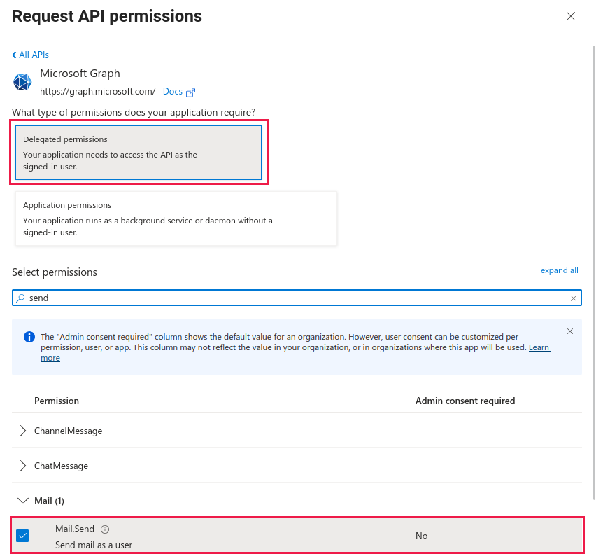](./images/Azure_AppReg06.png?raw=true)

4.7. Select **Microsoft Graph** from the available APIs, click on **Delegated permissions** and search for the **Mail.ReadWrite** permission. Select it and click on **Add permissions**.

[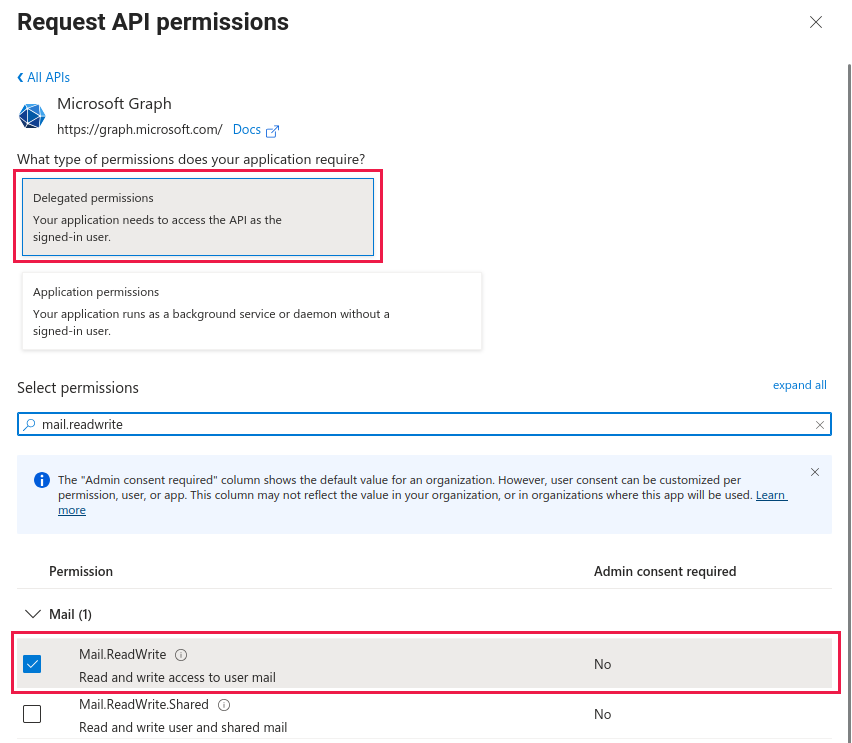](./images/Azure_AppReg07.png?raw=true)

4.8. You can remove the **User.Read** permission and admin consent from the API permissions list as you can see in the below screenshots.

[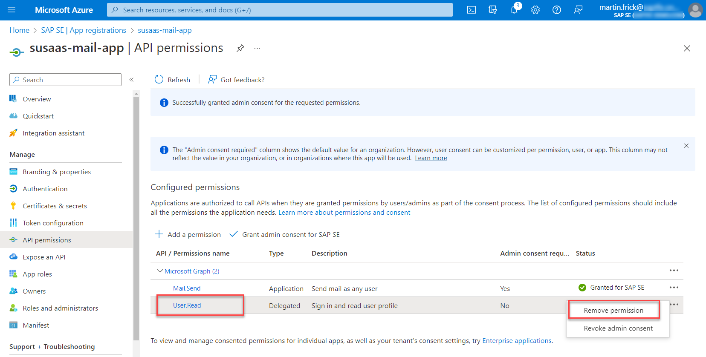](./images/Azure_AppReg08.png?raw=true)

[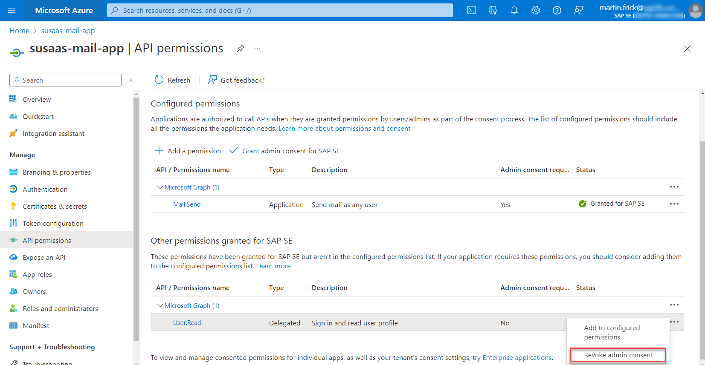](./images/Azure_AppReg09.png?raw=true)

4.9. Switch to the **Certificates & secrets** section and create a new **Client Secret**. Please copy the Secret value as you won't be able to see it again once you leave the page.

[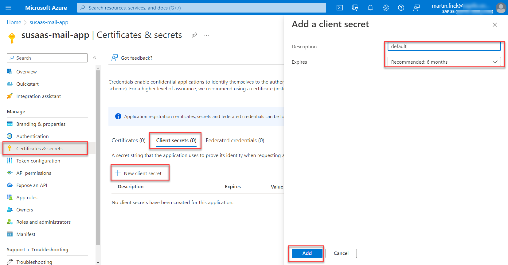](./images/Azure_AppReg10.png?raw=true)

[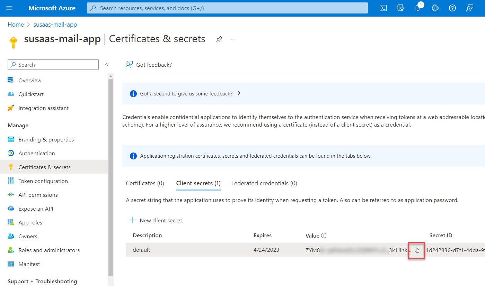](./images/Azure_AppReg11.png?raw=true)

5.0. Enable Public Client Flows for your Application Registration. This is required to use the **Client Credentials Flow** for authentication.

[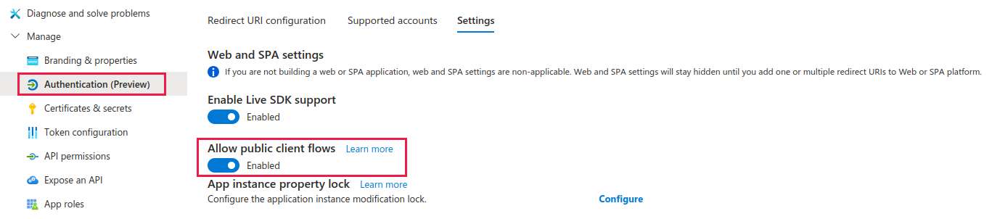](./images/Azure_AppReg12.png?raw=true)
